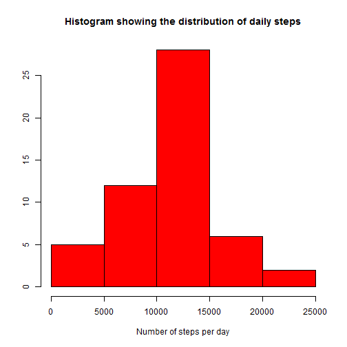
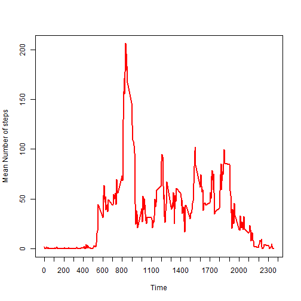
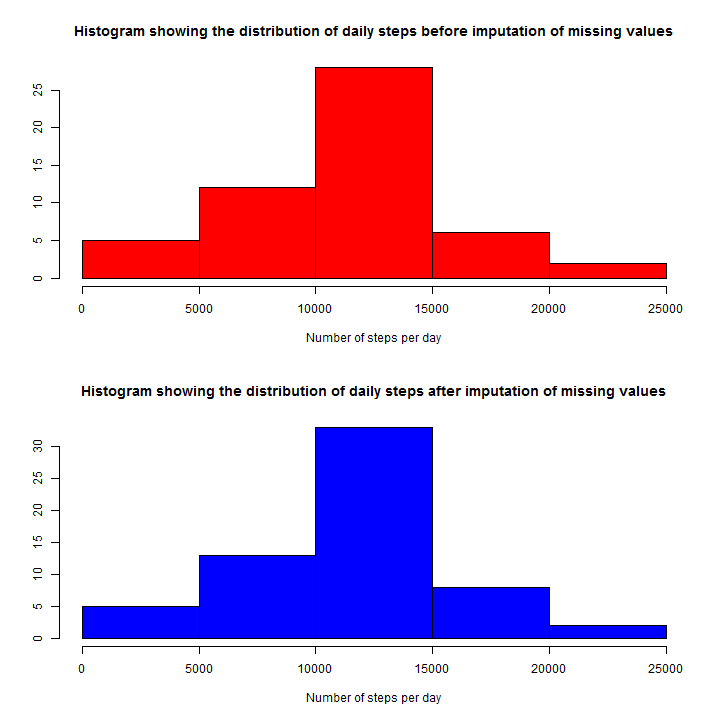
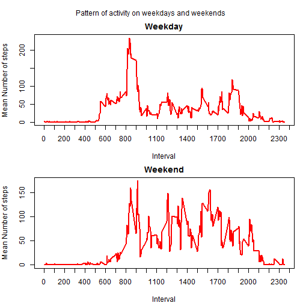

# Loading and pre-processing of the data

I read the data file "activity.csv"

```r
activity=read.csv("activity.csv")
```

```
## Warning in file(file, "rt"): cannot open file 'activity.csv': No such file
## or directory
```

```
## Error in file(file, "rt"): cannot open the connection
```

Using dplyr library, I created new data file,'dailyactivity' from the original one. 

```r
library(dplyr)
activity<-tbl_df(activity)
```

# What is mean total number of steps taken per day?

A new data file was created. It contains the the total numbers of steps taken per day. The first six rows are shown below.As I ignored the missing data, you can see that the total steps for the first day was missing

```r
dailyactivity<-activity %>%
  select(date,steps) %>%
    group_by(date) %>%
  summarize(na=sum(is.na(steps)),steps=sum(steps)) %>%
  ungroup()
```

```
## Error in eval(expr, envir, enclos): column 'date' has unsupported type : POSIXlt, POSIXt
```

```r
head(dailyactivity)
```

```
## Source: local data frame [6 x 3]
## 
##         date  na steps
## 1 2012-10-01 288    NA
## 2 2012-10-02   0   126
## 3 2012-10-03   0 11352
## 4 2012-10-04   0 12116
## 5 2012-10-05   0 13294
## 6 2012-10-06   0 15420
```
I made a histogram of the total number of steps taken each day bleow

```r
hist(dailyactivity$steps,col="red",xlab="Number of steps per day",ylab="",main="Histogram showing the distribution of daily steps")
```

 


```r
m<-round(mean(dailyactivity$steps,na.rm=T)/10000,5)*10000
mdn<-median(dailyactivity$steps,na.rm=T)
```
The mean of the total number of steps taken per day was 1.07662 &times; 10<sup>4</sup> and the median was 10765. 

# What is the average daily activity pattern?

I created a new data file to show the average daily activity pattern. The first few rows are shown below. 

```r
patternactivity<-activity %>%
  select(interval,steps) %>%
  group_by(interval) %>%
  summarize(steps=mean(steps,na.rm=T)) %>%
  ungroup()
head(patternactivity)
```

```
## Source: local data frame [6 x 2]
## 
##   interval     steps
## 1        0 1.7169811
## 2        5 0.3396226
## 3       10 0.1320755
## 4       15 0.1509434
## 5       20 0.0754717
## 6       25 2.0943396
```
A time series plot of the 5-minute interval (x-axis) and the average number of steps taken, averaged across all days (y-axis) is shown below

```r
plot(patternactivity$interval,
     patternactivity$steps,type="l",lwd=2,col="red",xaxp  = c(0, 2400, 24),
     ylab="Mean Number of steps",xlab="Time")
```

 

```r
max(patternactivity$steps)
```

```
## [1] 206.1698
```

```r
pmax<-patternactivity$interval[which.max(patternactivity$steps)]
```
On average across all the days in the dataset, the interval at 8:35 am contains the maximum number of steps

# Imputing missing values


```r
missing<-activity %>%
  select(date,steps) %>%
  group_by(date) %>%
  summarize(na=sum(is.na(steps))) %>%
  ungroup()
```

```
## Error in eval(expr, envir, enclos): column 'date' has unsupported type : POSIXlt, POSIXt
```

```r
table(missing$na)
```

```
## 
##   0 288 
##  53   8
```
There were missing number of steps in 2304 interval, comprimising 8 days

I used a mice library to impute the missing values. A new data file, imputed, contianig the imputed missing values was created

```r
library(mice)
summary(activity)
set.seed(144)
imputed = complete(mice(activity))
```

```
## Error: is.atomic(x) is not TRUE
```

```r
summary(imputed)

dailyimputed=imputed %>%
  select(date,steps) %>%
  group_by(date) %>%
  summarize(steps=sum(steps)) %>%
  ungroup
mimputed<-mean(dailyimputed$steps)
mdnimputed<-median(dailyimputed$steps)
```
The mean and the median of daily steps  ( 1.1124852 &times; 10<sup>4</sup> and 11352) slightly differed after imputation compared to their origninal values before imputation(1.07662 &times; 10<sup>4</sup> and 10765)

The following plot compares the daily activity before and after imputation. There is no subtle changes after imputation, only slight increase in the mean and medain number of steps.


```r
par(mfcol=c(2,1))
hist(dailyactivity$steps,col="red",xlab="Number of steps per day",ylab="",main="Histogram showing the distribution of daily steps before imputation of missing values")
hist(dailyimputed$steps,col="blue",xlab="Number of steps per day",ylab="",main="Histogram showing the distribution of daily steps after imputation of missing values")
```

 


# Are there differences in activity patterns between weekdays and weekends?

After Creating a new factor with two levels - "weekday" and "weekend" indicating whether a given date is a weekday or weekend day, I split the original data set into two. The following plot shows the difference in activity pattern between weekday and weekends. From this plot, it is clear that the activity in the weekdays starts earlier than on weekends. Another difference is that during weekends the activity seems to be spread through the whole day. On weekdays, the activity reaches its maximum around 8 a.m. then it declined and increased again around 6 p.m. Between these two hours, the activity is significanlty low.


```r
activity$date=strptime(activity$date,"%Y-%m-%d")
activity$weekday=weekdays(activity$date)
activity$day= ifelse(activity$weekday=="Saturday"|activity$weekday=="Sunday", 1, 0)
patternactivityday<-activity %>%
  select(interval,steps,day) %>%
  group_by(day,interval) %>%
  summarize(steps=mean(steps,na.rm=T)) %>%
  ungroup()
patternactivityweekday=patternactivityday[patternactivityday$day==0,]

patternactivityweekend=patternactivityday[patternactivityday$day==1,]
par(mfrow=c(2,1),mar=c(4,4,2,1),oma=c(0,0,2,0))
plot(patternactivityweekday$interval,
     patternactivityweekday$steps,type="l",lwd=2,col="red",xaxp  = c(0, 2400, 24),
     ylab="Mean Number of steps",xlab="Interval",main="Weekday")
plot(patternactivityweekend$interval,
     patternactivityweekend$steps,type="l",lwd=2,col="red",xaxp  = c(0, 2400, 24),
     ylab="Mean Number of steps",xlab="Interval",main="Weekend")
mtext("Pattern of activity on weekdays and weekends",outer=TRUE)
```

 
